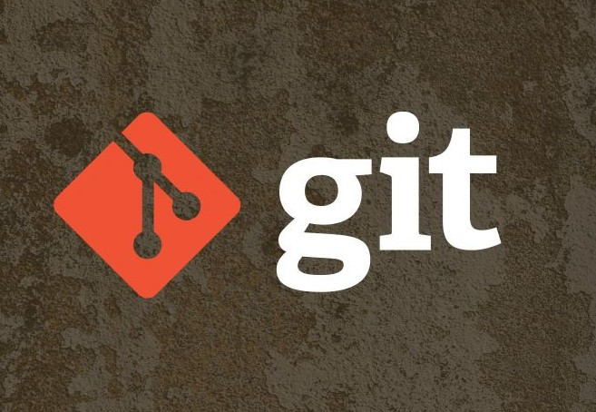
# Инструкция по работе с Git

*краткая памятка по основным командам для старта работы*

<blockquote> Cкоро останутся лишь две группы работников: те, кто контролирует компьютеры, и те, кого контролируют компьютеры. Постарайтесь попасть в первую.

Льюис Д. Эйген в 1961 г.</blockquote>

## Содержание
1. Установка Git 
2. Проверка установленного Git
3. Настройка Git
4. Инициализация репозитория
5. Запись изменений в репозитории
    5.1 состояние файла
    5.2 отслеживание новых файлов
    5.3 комментирование изменений
    5.4 отслеживание изменений
    5.5 просмотр истории коммитов
    5.6 перемещение между сохраниениями
6. Работа с ветками
    6.1 создание
    6.2 переключение между ветками
    6.3 слияние
    6.4 разрешение конфликтов
    6.5 удаление
7. Игнорирование файлов
8. Работа с удаленными репозиториями
    8.1 регистрация на github
    8.2 подключение
    8.3 отправка изменений на сервер
    8.4 клонирование репозитория
    8.5 запрос изменений с сервера
    8.6 git fetch - "безопасная" загрузка изменений
    8.7 конфликт слияния локального и удаленного репозитория
    8.8 fork и pull-request 
9. Итог
## 1. Установка Git
<code>[Переходим на сайт](https://git-scm.com/)
</code>  
Скачиваем последнюю версию файла для своей системы.

## 2. Проверка установленного Git
Чтобы проверить *правильно* ли установлен Git, наберем в терминале команду **git version**. Если Git установлен правильно, появятся сведения о действующей версии Git. Если нет - информация об ошибке.
## 3. Настройка Git 
Итак, мы установили git, теперь нужно добавить немного настроек. Наше имя пользователя и адрес электронной почты. Откроем терминал и запустим команды:  
**git config --global user.name "My Name"**

**git config --global user.email myEmail@example.com**

Теперь каждое наше действие будет отмечено именем и почтой. Таким образом, пользователи всегда будут в курсе, кто отвечает за какие изменения — это вносит порядок.
## 4. Инициализация репозитория
Как мы отметили ранее, git хранит свои файлы и историю прямо в папке проекта. Чтобы создать новый репозиторий, нам нужно открыть терминал, зайти в папку нашего проекта и выполнить команду   
**git init**.  
Командная строка должна вернуть что-то вроде:  
Initialized empty Git repository in /home/user/Desktop/git_exercise/.git/  
Это значит, что наш репозиторий был успешно создан, но пока что пуст.
## 5. Запись изменений в репозитории
### 5.1 состояние файла
**git status** — это еще одна важнейшая команда, которая показывает информацию о текущем состоянии репозитория: актуальна ли информация на нём, нет ли чего-то нового, что поменялось, и так далее.  
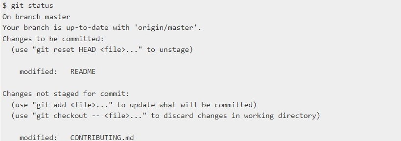
### 5.2 отслеживание новых файлов
В Git есть концепция области подготовленных файлов. Можно представить ее как холст, на который наносят изменения, которые нужны в коммите. Сперва он пустой, но затем мы добавляем на него файлы (или части файлов, или даже одиночные строчки) командой **git add** и, наконец, коммитим все нужное в репозиторий.
### 5.3 комментирование изменений
Коммит представляет собой состояние репозитория в определенный момент времени. Это похоже на снапшот, к которому мы можем вернуться и увидеть состояние объектов на определенный момент времени.
Чтобы зафиксировать изменения, нам нужно хотя бы одно изменение в области подготовки (мы только что создали его при помощи git add), после которого мы может коммитить:

**git commit -m "Initial commit."**

Эта команда создаст новый коммит со всеми изменениями из области подготовки (добавление файла). Ключ -m и сообщение «Initial commit.» — это созданное пользователем описание всех изменений, включенных в коммит. Считается хорошей практикой делать коммиты часто и всегда писать ``забавные`` содержательные комментарии.
### 5.4 отслеживание изменений
Если результат работы команды **git status** недостаточно информативен — нужно знать, что конкретно поменялось, а не только какие файлы были изменены — можно использовать команду **git diff**. Эта команда используется для получения ответов на два вопроса: что мы изменили, но ещё не проиндексировали, и что ьы проиндексировали и собираемся включить в коммит. Если **git status** отвечает на эти вопросы в самом общем виде, перечисляя имена файлов, **git diff** показывает нам непосредственно добавленные и удалённые строки — патч как он есть.

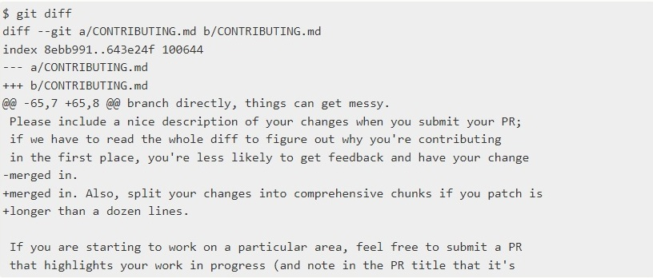

### 5.5 просмотр истории коммитов
После того, как мы создали несколько коммитов,вероятно, нам понадобится возможность посмотреть, что было сделано — историю коммитов. Одним из основных и наиболее мощных инструментов для этого является команда **git log**.
По умолчанию (без аргументов) **git log** перечисляет коммиты, сделанные в репозитории в обратном к хронологическому порядке — последние коммиты находятся вверху. 
### 5.6 перемещение между сохраниениями
Команда **git checkout** позволяет переключаться между последними коммитами (если упрощенно) веток.
## 6. Работа с ветками
 Используя ветвление, мы отклоняемся от основной линии разработки и продолжаем работу независимо от неё, не вмешиваясь в основную линию. Ветвление Git очень легковесно: операция создания ветки выполняется почти мгновенно, переключение между ветками туда-сюда, обычно, также быстро. Git поощряет процесс работы, при котором ветвление и слияние выполняется часто, даже по несколько раз в день. Понимание и владение этой функциональностью дает разработчикам уникальный и мощный инструмент, который может полностью изменить привычный процесс разработки. 
### 6.1 создание
Создание новой ветки происходит командой  
**git branch "branch name"**
### 6.2 переключение между ветками
Для переключения между существующими ветками проекта используем команду  
**git checkout "branch name"**  
Важно запомнить, что при переключении веток в Git происходит изменение файлов в рабочем каталоге. Если vs переключаеься на старую ветку, то рабочий каталог будет выглядеть так же, как выглядел на момент последнего коммита в ту ветку.
### 6.3 слияние
Когда работа с веткой закончена, её можно влить в ветку **master**. Для этого нужно выполнить слияние ветки. Все, что нужно сделать — переключиться на ветку, в которую вы хотим включить изменения, и выполнить команду **git merge**.  
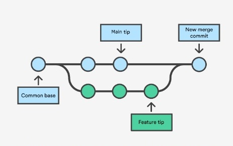
### 6.4 разрешение конфликтов
Если мы изменили одну и ту же часть одного и того же файла по-разному в двух объединяемых ветках, Git не сможет их чисто объединить. Если исправление ошибки #53 потребовало изменить ту же часть файла что и hotfix, вы получите  
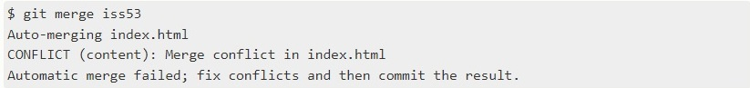
Git не создал коммит слияния автоматически. Он остановил процесс до тех пор, пока вы не разрешите конфликт.
#### Первый тип конфликта слияния  
Git прерывает работу в самом начале слияния
Выполнение команды слияния прерывается в самом начале, если Git обнаруживает изменения в рабочем каталоге или разделе проиндексированных файлов текущего проекта. Git не может выполнить слияние, поскольку иначе эти ожидающие изменения будут перезаписаны новыми коммитами. Такое случается из-за конфликтов не с другими разработчиками, а с ожидающими локальными изменениями. Локальное состояние необходимо стабилизировать с помощью команд git stash, git checkout, git commit или git reset. Если команда слияния прерывается в самом начале, выдается следующее об ошибке  
**error: Entry '<fileName>' not uptodate. Cannot merge. (Changes in working directory)**  
#### Второй тип конфликтов слияния
Git прерывает работу во время слияния
Сбой В ПРОЦЕССЕ слияния говорит о наличии конфликта между текущей локальной веткой и веткой, с которой выполняется слияние. Это свидетельствует о конфликте с кодом другого разработчика. Git сделает все возможное, чтобы объединить файлы, но оставит конфликтующие участки, чтобы вы разрешили их вручную. При сбое во время выполнения слияния выдается следующее сообщение об ошибке:  
**error: Entry '<fileName>' would be overwritten by merge. Cannot merge. (Changes in staging area)**
### 6.5 удаление
Чтобы удалить ветку из локального Git-репозитория, выполним:  
**git branch -d <имя_ветки>**
## 8. Работа с удаленными репозиториями
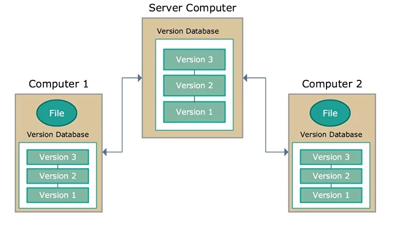
Удаленный (иногда говорят "внешний") репозиторий – это версии вашего проекта, сохраненные на удаленном сервере. Доступ к репозиторию на таком сервере может осуществляться по интернету или по локальной сети.
Удаленный репозиторий – полноценный репозиторий, ничем не отличающийся от локального. У удаленного репозитория есть собственные ветки, собственный указатель HEAD, своя история коммитов и так далее.  
Если мы подключим удаленный репозиторий к своему локальному, то у нас появятся копии всех ссылочных объектов удаленного репозитория.
### 8.1 регистрация на GitHub
Заходим на [GitHub](https://github.com) и создаём свой аккаунт. 
### 8.2 подключение
Чтобы связать наш локальный репозиторий с репозиторием на GitHub, выполним следующую команду в терминале: **git remote add (repo name)**. Проект может иметь несколько удаленных репозиториев одновременно. Чтобы их различать, мы дадим им разные имена. Обычно главный репозиторий называется origin.
### 8.3 отправка изменений на сервер
Начнём переслать наш локальный коммит на сервер. Этот процесс происходит каждый раз, когда мы хотим обновить данные в удаленном репозитории.
Команда **git push (имя удаленного репозитория) (имя ветки)**. 
### 8.4 клонирование репозитория
Теперь другие пользователи GitHub могут просматривать наш репозиторий. Они могут скачать из него данные и получить полностью работоспособную копию нашего проекта при помощи команды   
**git clone (ссылка на удаленный репозиторий)**.   
В директории, откуда мы запустили команду **git clone**, создается директория с именем репозитория. В созданную директорию копируется репозиторий, все его ветки и коммиты. 
### 8.5 запрос изменений с сервера 
Если мы сделали изменения в нашем удаленном репозитории, другие пользователи могут скачать изменения при помощи команды  
**git pull (имя удаленного репозитория) (имя ветки)** 
Эта команда получает изменения из переданного удаленного репозитория и обновляет рабочую копию в соответствии с удаленным репозиторием. По умолчанию слияние удаленной ветки с локальной происходит именно в fast-forward режиме, так что включать его специально не требуется.  
**git pull** используется для синхронизации локальной рабочей копии и всех ссылочных объектов с удаленным репозиторием.
По сути, **git pull** - это то же самое, что **git fetch** + **git merge**.
### 8.6 git fetch - "безопасная" загрузка изменений
Команда **git fetch (имя удаленного репозитория) (имя ветки)** загружает коммиты, файлы и ссылки из удаленного репозитория в наш локальный репозиторий. Извлечение данных с помощью команды fetch, поможет увидеть, над чем работают остальные. Эта команда позволяет увидеть прогресс в центральном репозитории, но при этом не вынуждает нас выполнять слияние изменений с нашим репозиторием. Извлеченное содержимое в Git остается изолированным от имеющихся локальных данных и совершенно не влияет на локальную разработку. Чтобы переключиться на извлеченное содержимое, нужно отдельно запустить команду **git checkout**. Таким образом, применение команды fetch позволяет безопасно просмотреть коммиты, перед тем как интегрировать их в локальный репозиторий.
Загрузить содержимое из удаленного репозитория можно с помощью двух команд: **git pull** и **git fetch**. Из этих двух команд **git fetch** можно считать «безопасным» вариантом. Она загружает удаленное содержимое, но не обновляет рабочее состояние локального репозитория, оставляя текущую работу нетронутой. Команда **git pull** действует более агрессивно: она загружает удаленное содержимое для активной локальной ветки и сразу выполняет команду **git merge**, создавая коммит слияния для нового удаленного содержимого. Если у нас есть ожидающие изменения, то возникнут конфликты, и будет запущен процесс разрешения конфликтов слияния.
### 8.7 Конфликт слияния локального и удаленного репозитория
**fatal: refusing to merge unrelated histories**  
 ошибка Git которая возникает, когда два не связанных между собой проектов объединяются (то есть проекты, которые не знают о существовании друг друга и не соответствующие фиксации истории). Рассмотрим следующие два случая, которые выдают эту ошибку:
- Мы клонировали проект, и .gitкаталог каким-то образом был удален или поврежден. Это приводит к тому, что Git не знает о нашей локальной истории и, следовательно, заставляет его выдавать эту ошибку, когда мы пытаетеься отправить или извлечь из удаленного репозитория.
- Мы создали новый репозиторий, добавили в него несколько коммитов , и теперь мы пытаемся извлечь из удаленного репозитория, который уже имеет некоторые свои коммиты. Git также выдаст ошибку в этом случае, так как он понятия не имеет, как связаны два проекта.
Ошибка устраняется путем добавления **--allow-unrelated-histories** после команды git pullили git merge.  
**git pull --allow-unrelated-histories**
### 8.8 fork и pull-request 
Одной из самых важных частей GitHub является создание форков. 
Форк (от англ. fork – вилка) – точная копия репозитория, но в вашем аккаунте. Форки нужны, чтобы вносить свои изменения в проект, к репозиторию которого у вас нет прямого доступа.
Пулл-реквест (от англ. pull-request – запрос pull) – функция GitHub, позволяющая попросить владельца репозитория, от которого мы сделали форк, загрузить наши изменения обратно в свой репозиторий.
сли коротко, форки и пулл-реквесты нужны, чтобы любой пользователь мог внести свой вклад в любой открытый проект, репозиторий которого есть на GitHub. Кроме того, перед тем как влить ваши изменения в основной репозиторий, ответственные обязательно проверят ваш код на наличие ошибок и уязвимостей. Таким образом, даже если ваши изменения не примут, вы получите первоклассный code-review с указанием всех неточностей.

Теперь давайте рассмотрим пайплайн контрибуции (англ. contribution – внесение вклада) на примере реального репозитория. То есть научимся вносить свой вклад в разработку проектов с открытым исходным кодом на GitHub.

1. Для начала зайдем на страницу репозитория проекта. Нажимаем на кнопку Fork, как показано на картинке. После этого Git создаст точную копию этого репозитория в вашем аккаунте.
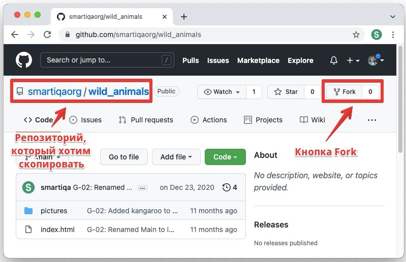
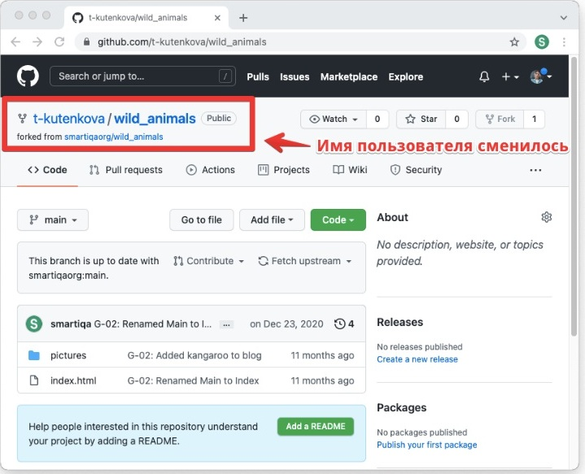
2. Клонируем репозиторий к себе на компьютер командой git clone. Создадим файл README.md с описанием проекта, чтобы другим пользователям было понятно, в чем отличие этой реализации от остальных.

3. Сделаем коммит и выполним git push, чтобы загрузить наши изменения в удаленный репозиторий.

4. Теперь GitHub подсказывает нам, что наша ветка опережает ветку исходного репозитория на один коммит и предлагает сделать пулл-реквест.
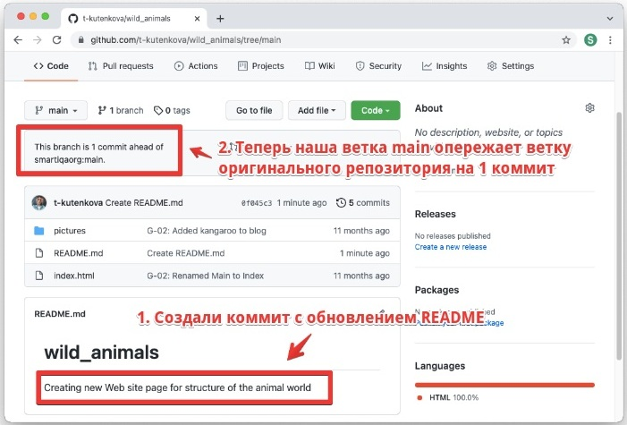
5. Нажимаем на кнопку Compare на подсказке GitHub, либо переходим на вкладку Pull Requests и нажимаем New pull request.
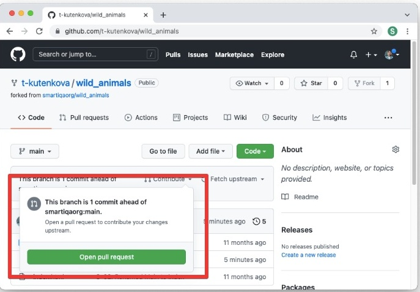
6. Перед нами откроется страница создания пулл-реквеста.
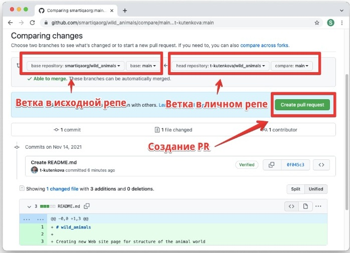
Здесь мы можем просмотреть внесенные изменения и выбрать две ветки: одну в исходном репозитории, на нее будут залиты наши изменения, вторую – в нашем репозитории, с нее будут скачаны изменения. Как только мы выбрали ветки и убедились, что не внесли никаких лишних изменений, нажимаем кнопку Create pull request.

7. Теперь мы попадаем на страницу описания наших изменений.
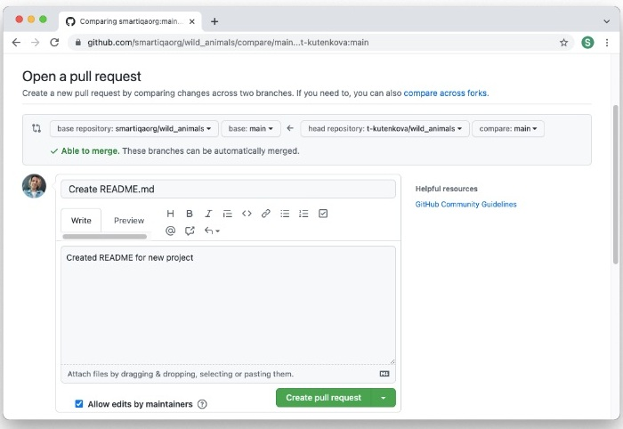
Здесь необходимо описать, что за изменения вы внесли и почему они были необходимы. Сообщение, которое оставили мы, видно на картинке. Оно отражает суть и необходимость внесенных изменений. Как только мы закончили с описанием, можно нажимать кнопку Create pull request.

8. Теперь мы попадаем на страницу уже созданного пулл-реквеста в изначальном репозитоии. В нашем случае он выглядит так.
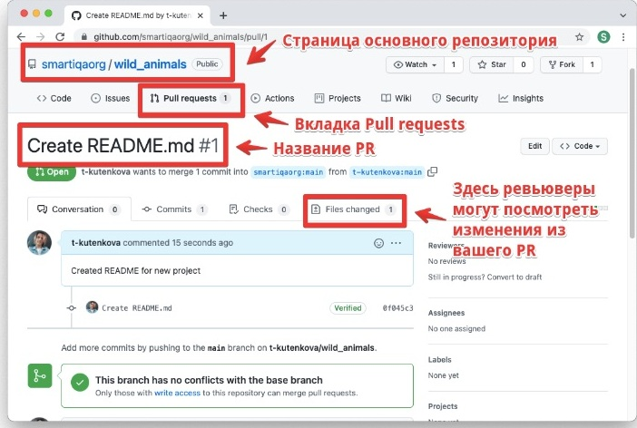
Именно так будет выглядеть наш пулл-реквест и для владельца репозитория. На этой странице он сможет писать комментарии, указывая на ошибки или задавая вопросы. После того, как владелец репозитория просмотрит наши изменения и убедится, что они не имеют вредоносный характер, он сможет принять наш пулл-реквест. Тогда все изменения, добавленные в этот пулл-реквест нами, будут залиты в исходный репозиторий.
Таким образом, вы можете вносить свой вклад в абсолютно любые приложения с открытым программным кодом. Даже репозиторий самого Git хранится на GitHub, и вы в любой момент можете сделать форк и придумать новую команду (правда не факт, что ответственный примет ваш пулл-реквест). Вы можете внести свой вклад в разработку ядра Linux, в популярный редактор Visual Studio Code, в ядро криптовалюты Bitcoin, в языки программирования Python, Go, Ruby – все эти проекты имеют открытые репозитории на GitHub.
## 9. Итог
Для старта работы с Git этого хватит. Если возникнут какие-то вопросы, дополнительную информацию и объяснения можно найти <code>[на сайте](https://git-scm.com/book/en/v2)</code>.
